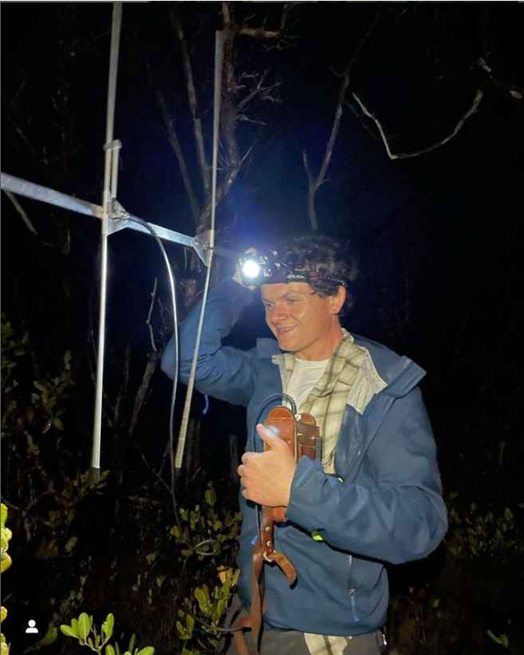

# Andrew Veselka

I am a Phd student in the [EBIO department](https://www.colorado.edu/ebio/) of CU Boulder. I study the effects of wildfire and habitat fragmentation on insect communities. 
- landscape ecology
- habitat fragmentation
- community ecology
- fire
